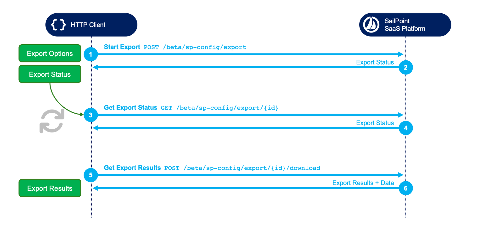
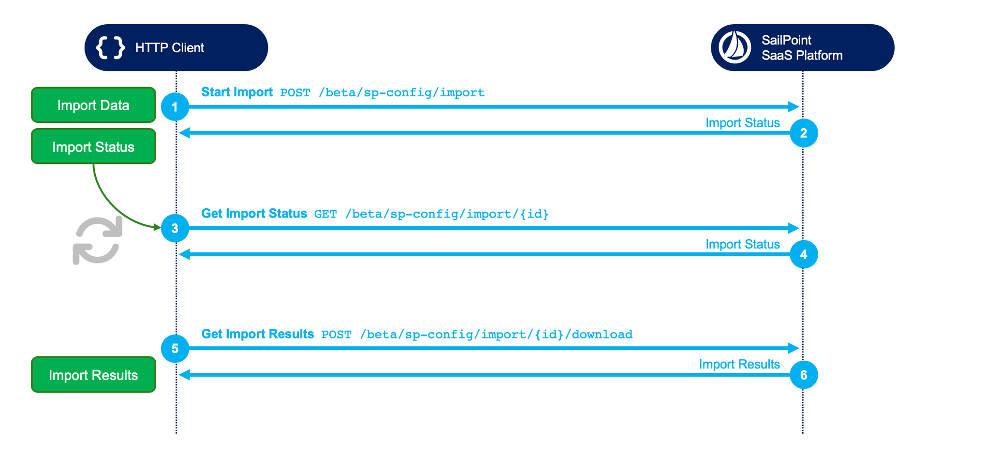

# Overview

This is a guide on using the SailPoint SaaS Configuration APIs in order to import and export configurations from the SailPoint SaaS system.  This is intended to be used to get configurations in bulk in support of environmental promotion, go-live, or tenant-to-tenant configuration management processes and pipelines.

For more details around how to manage configurations, refer to [SailPoint SaaS Change Management and Deployment Best Practices](https://community.sailpoint.com/t5/IdentityNow-Articles/SailPoint-SaaS-Change-Management-and-Deployment-Best-Practices/ta-p/189871).

## Audience

This document is intended for technically proficient administrators, implementers, integrators or even developers.  No coding experience is necessary, but being able to understand JSON data structures and make REST API web-service calls is needed to fully understand this.

## Supported Objects

| **Object**                  | **Object Type**        | **Export**                                                   | **Import**                                                   |
| :-------------------------- | :--------------------- | :----------------------------------------------------------- | :----------------------------------------------------------- |
| Event Trigger Subscriptions | `TRIGGER_SUBSCRIPTION` |  |  |
| Identity Profiles           | `IDENTITY_PROFILE`     |  |  |
| Rules                       | `RULE`                 |  |  |
| Sources                     | `SOURCE`               |  |  |
| Transforms                  | `TRANSFORM`            |  |  |


**Note:** The available supported objects are also available via REST API too!  See List Configuration Objects in the **API Reference** section of this document. 

**Rule Import and Export -** Rules are allowed to be exported from one tenant and imported into another.  Cloud Rules have already been reviewed and installed in other tenants, and Connector Rules do not require a rule review.  During the import and export process rules cannot be changed in the migration process, as these are validated by the usage of `jwsHeader` and `jwsSignature` in the object.  


## Exporting Configurations


### Prerequisites

- Need to have credentials as a tenant administrator (`ORG_ADMIN`)
- Understanding of what objects you’d like to export


### Process



1. **Start Export** - Start the export process by configuring a JSON payload for the export options.  This should then be sent to `POST /beta/sp-config/export`.  
2. **Response with Export Status** - An export status will given in response.  This contains a `jobId` and a `status` which should be used to subsequently monitor the process.  Initially this might have a status of `NOT_STARTED`.
3. **Get Export Status** - Using the `jobId` from the previous status, call `GET /beta/sp-config/export/{id}` where the `{id}` is the `jobId`.
4. **Response with Export Status** - An export status will given in response.  This contains a `jobId` and a `status` which should be used to subsequently monitor the process.  After a period of time, the process `status` should move to either `COMPLETE` or `FAILED`.  Depending on the amount of objects being exported, this could take awhile.  It might be ncessary to iterate over steps 3 and 4 until the status reflects a completion.  If it takes too long, the export process may expire.  
5. **Get Export Results** - Once the status is `COMPLETE`, download the export results by calling `GET /beta/sp-config/export/{id}/download` where the `{id}` is the `jobId`.
6. **Response with Export Results** - In response, the export process should produce a set of JSON objects which you can download as an export result set.  These should reflect the objects that were selected in the export options earlier.


## Importing Configurations


### Prerequisites

- Need to have credentials as a tenant administrator (`ORG_ADMIN`)
- Prepare any objects to be imported into the system, as well as import options.


### Process



1. **Start Import** - Start the import process by configuring a JSON payload for the import options.  This should then be sent to `POST /beta/sp-config/import`.  
2. **Response with Import Status** - An import status will given in response.  This contains a `jobId` and a `status` which should be used to subsequently monitor the process.  Initially this might have a status of `NOT_STARTED`.
3. **Get Import Status** - Using the `jobId` from the previous status, call `GET /beta/sp-config/import/{id}` where the `{id}` is the `jobId`.
4. **Response with Import Status** - An import status will given in response.  This contains a `jobId` and a `status` which should be used to subsequently monitor the process.  After a period of time, the process `status` should move to either `COMPLETE` or `FAILED`.  Depending on the amount of objects being imported, this could take awhile.  It might be ncessary to iterate over steps 3 and 4 until the status reflects a completion.  If it takes too long, the import process may expire.  
5. **Get Import Results** - Once the status is `COMPLETE`, download the import results by calling `GET /beta/sp-config/import/{id}/download` where the `{id}` is the `jobId`.
6. **Response with Import Results** - In response, the import process should produce listing of object that successfully imported, as well as any errors, warnings, or information about the import process.   This result set should reflect the objects that were selected to be imported earlier.


## API Reference Guide

| **Description**     | **REST API End-Point**                     |
| :------------------ | :----------------------------------------- |
| List Config Objects | `GET /beta/sp-config/config-objects`       |
| Export Objects      | `POST /beta/sp-config/export`              |
| Export Status       | `GET /beta/sp-config/export/{id}`          |
| Export Results      | `GET /beta/sp-config/export/{id}/download` |
| Import Objects      | `POST /beta/sp-config/import`              |
| Import Status       | `GET /beta/sp-config/import/{id}`          |
| Import Results      | `GET /beta/sp-config/import/{id}/download` |


### List Configuration Objects

**Description**

Lists all available objects which can be imported and exported into the system.

**Request**

```json
GET /beta/sp-config/config-objects
Authorization: Bearer {token}
```

**Response**

```json
200 OK
Content-Type: application/json

[
    {
        "objectType": "SOURCE",
        "resolveByIdUrl": {
            "url": "diana://v3/sources/sources/$id",
            "query": null
        },
        "resolveByNameUrl": {
            "url": "diana://v3/sources/sources/",
            "query": {
                "filters": "name eq \"$name\""
            }
        },
        "exportUrl": "diana://v3/sources/sources/export",
        "exportLimit": 10,
        "importUrl": "diana://v3/sources/sources/import",
        "importLimit": 10,
        "referenceExtractors": null,
        "signatureRequired": false
    },
    {
        "objectType": "TRIGGER_SUBSCRIPTION",
        "resolveByIdUrl": {
            "url": "ets://trigger-subscriptions/$id",
            "query": null
        },
        "resolveByNameUrl": {
            "url": "ets://trigger-subscriptions/",
            "query": {
                "filters": "name eq \"$name\""
            }
        },
        "exportUrl": "ets://trigger-subscriptions/export",
        "exportLimit": 10,
        "importUrl": "ets://trigger-subscriptions/import",
        "importLimit": 10,
        "referenceExtractors": null,
        "signatureRequired": false
    },
    {
        "objectType": "RULE",
        "resolveByIdUrl": {
            "url": "rms://rules/$id",
            "query": null
        },
        "resolveByNameUrl": {
            "url": "rms://rules",
            "query": {
                "filters": "name eq \"$name\""
            }
        },
        "exportUrl": "rms://rules/export",
        "exportLimit": 10,
        "importUrl": "rms://rules/import",
        "importLimit": 10,
        "referenceExtractors": null,
        "signatureRequired": true
    },
    {
        "objectType": "TRANSFORM",
        "resolveByIdUrl": {
            "url": "trams://v3/transforms/$id",
            "query": null
        },
        "resolveByNameUrl": {
            "url": "trams://v3/transforms",
            "query": {
                "name": "$name"
            }
        },
        "exportUrl": "trams://v3/export-transforms",
        "exportLimit": 10,
        "importUrl": "trams://v3/import-transforms",
        "importLimit": 10,
        "referenceExtractors": null,
        "signatureRequired": false
    }
]
```


### Export Objects

**Description**

Starts an export process to export selected objects from the system.

**Request**

```json
POST /beta/sp-config/export
Authorization: Bearer {token}
Content-Type: application/json

{
  "description": "Export from Neil's SailPoint tenant",
  "excludeTypes": [
    "TRIGGER_SUBSCRIPTION"
  ],
  "includeTypes": [
    "SOURCE",
    "RULE",
    "TRANSFORM"
  ],
  "objectOptions": {
    "SOURCE": {
      "includedIds": [
      ],
      "includedNames": [
        "Active Directory"
      ]
    },
    "RULE": {
      "includedIds": [
      ],
      "includedNames": [
        "JDBCProvisioning Rule Adapter"
      ]
    },
    "TRANSFORM": {
      "includedIds": [
      ],
      "includedNames": [
          "Calculate Display Name",
        "Default Email",
        "Determine Email",
        "Account Status to Lifecycle State"
      ]
    }
  }
}
```

**Response**

```json
202 Accepted
Content-Type: application/json

{
    "jobId": "19169053-66d2-40c6-8772-9e2bf55edcf6",
    "status": "NOT_STARTED",
    "type": "EXPORT",
    "message": null,
    "description": "Export from Neil's SailPoint tenant",
    "expiration": "2021-09-03T15:55:29.127Z",
    "created": "2021-08-27T15:55:29.127Z",
    "modified": "2021-08-27T15:55:29.127Z",
    "completed": null
}
```


### Export Status

**Description**

Gets the status of an export process.

**Request**

```json
GET /beta/sp-config/export/{id}
Authorization: Bearer {token}
```

**Response**

```json
200 OK
Content-Type: application/json

{
    "jobId": "19169053-66d2-40c6-8772-9e2bf55edcf6",
    "status": "COMPLETE",
    "type": "EXPORT",
    "message": null,
    "description": "Export from Neil's SailPoint tenant",
    "expiration": "2021-09-03T15:55:29Z",
    "created": "2021-08-27T15:55:29.127Z",
    "modified": "2021-08-27T15:55:37.59Z",
    "completed": "2021-08-27T15:55:37.583Z"
}
```


### Export Results

**Description**

Gets the results of an export process.

**Request**

```json
GET /beta/sp-config/export/{id}/download
Authorization: Bearer {token}
```

**Response**

```json
200 OK
Content-Type: application/json

{
    "version": 1,
    "timestamp": "2021-08-27T15:55:37.37883Z",
    "tenant": "neil-test",
    "description": "Export from Neil's SailPoint tenant",
    "options": {
        "excludeTypes": [
            "TRIGGER_SUBSCRIPTION"
        ],
        "includeTypes": [
            "SOURCE",
            "RULE",
            "TRANSFORM"
        ],
        "objectOptions": {
            "SOURCE": {
                "includedIds": [],
                "includedNames": [
                    "Active Directory"
                ]
            },
            "RULE": {
                "includedIds": [],
                "includedNames": [
                    "JDBCProvisioning Rule Adapter"
                ]
            },
            "TRANSFORM": {
                "includedIds": [],
                "includedNames": [
                    "Calculate Display Name"
                ]
            }
        }
    },
    "objects": [{
            "version": 1,
            "self": {
                "name": "Active Directory [source-101921]",
                "id": "2c91808363dae20e0163dbef5a7d2de9",
                "type": "SOURCE"
            },
            "object": {
                "id": "2c91808363dae20e0163dbef5a7d2de9",
                "name": "Active Directory",
                "type": "Active Directory - Direct",
                "connectorClass": "sailpoint.connector.ADLDAPConnector",
                "connectorScriptName": "active-directory",
                "description": "SailPoint Active Directory",
                "deleteThreshold": 10.0,
                "provisionAsCsv": false,
                "owner": {
                    "type": "IDENTITY",
                    "id": "ff80818155fe8c080155fe8d925b0316",
                    "name": "slpt.services"
                },
                ...
            }
        },
        {
            "version": 1,
            "self": {
                "name": "JDBCProvisioning Rule Adapter",
                "id": "ff8081815bc9f6c6015bd491edbe0023",
                "type": "RULE"
            },
            "object": {
                "description": null,
                "type": "JDBCProvision",
                "signature": {
                    "input": [],
                    "output": null
                },
                "sourceCode": {
                    "version": "1.0",
                    "script": "\n\t  \nimport sailpoint.services.JDBCProvisioning;\nreturn JDBCProvisioning.provision( application, schema, connection, plan );\n\t"
                },
                "attributes": null,
                "id": "ff8081815bc9f6c6015bd491edbe0023",
                "name": "JDBCProvisioning Rule Adapter",
                "created": "2017-05-04T17:46:25.086Z",
                "modified": "2018-06-29T15:45:42.375Z"
            },
            "jwsHeader": "eyJhbGciOiJFUzI1NiJ9",
            "jwsSignature": "cbvjeLOIJajrJBs1dLc60p8rJ46wYnUYyEAG1ECPn7ahIvy9G109oyjfNAGkR6eguewW2NEzP0mJcK6vOEtbfw"
        },
        {
            "version": 1,
            "self": {
                "name": "Calculate Display Name",
                "id": "24e5ad57-c12d-4e62-92fe-88c40b39ad6b",
                "type": "TRANSFORM"
            },
            "object": {
                "id": "24e5ad57-c12d-4e62-92fe-88c40b39ad6b",
                "name": "Calculate Display Name",
                "type": "trim",
                "attributes": {
                    "input": {
                        "attributes": {
                            "firstName": {
                                "attributes": {
                                    "name": "firstname"
                                },
                                "type": "identityAttribute"
                            },
                            "lastName": {
                                "attributes": {
                                    "name": "lastname"
                                },
                                "type": "identityAttribute"
                            },
                            "department": {
                                "attributes": {
                                    "name": "department"
                                },
                                "type": "identityAttribute"
                            },
                            "type": {
                                "attributes": {
                                    "name": "employeeType"
                                },
                                "type": "identityAttribute"
                            },
                            "value": "#if ( $type == 'E' ) $lastName $firstName $department #elseif ( $type == 'H' ) $lastName $firstName $department #elseif ( $type == 'S' ) $lastName $firstName $department #else $lastName $firstName (Contractor) #end"
                        },
                        "type": "static"
                    }
                },
                "internal": false
            }
        }
    ]
}
```


### Import Objects

**Description**

Starts an import process to import selected objects into the system.

**Request**

```json
POST /beta/sp-config/import
Authorization: Bearer {token}
Content-Type: multipart/form-data

data: (File) data.json
```

**Response**

```json
202 Accepted
Content-Type: application/json

{
    "jobId": "333e8c69-2c38-4caa-9212-ba62b4f2623d",
    "status": "NOT_STARTED",
    "type": "IMPORT",
    "message": null,
    "description": null,
    "expiration": "2021-06-11T02:59:56.569Z",
    "created": "2021-06-04T02:59:56.569Z",
    "modified": "2021-06-04T02:59:56.57Z",
    "completed": null
}
```

**Note**: Import also has a “preview” option if you would like to see what an import might look like without actually having to import and change your tenant.  Any errors discovered during reference or resource resolution will be provided.   To use this, simply set query option `preview` to `true`.  

Example: `POST /beta/sp-config/import?preview=true`


### Import Status

**Description**

Gets the status of an import process.

**Request**

```json
GET /beta/sp-config/import/{id}
Authorization: Bearer {token}
```

**Response**

```json
200 OK
Content-Type: application/json

{
    "jobId": "333e8c69-2c38-4caa-9212-ba62b4f2623d",
    "status": "FAILED",
    "type": "IMPORT",
    "message": "Import halted because of errors. Download results for error details.",
    "description": null,
    "expiration": "2021-06-11T02:59:56Z",
    "created": "2021-06-04T02:59:56.569Z",
    "modified": "2021-06-04T02:59:57.568Z",
    "completed": "2021-06-04T02:59:57.563Z"
}
```


### Import Results

**Description**

Gets the results of an import process.

**Request**

```json
GET /beta/sp-config/import/{id}/download
Authorization: Bearer {token}
```

**Response**

```json
200 OK
Content-Type: application/json

{
    "results": {
        "TRIGGER_SUBSCRIPTION": {
            "infos": [],
            "warnings": [],
            "errors": [
                {
                    "key": null,
                    "text": "There was an error importing 'TRIGGER_SUBSCRIPTION' with name 'Access Request sub' and id 'f69b6ae7-0709-4432-becd-0a98bb802c3a' Exception com.sailpoint.ets.exception.DuplicatedSubscriptionException",
                    "detail": null
                }
            ],
            "importedObjects": [
                {
                    "name": "test",
                    "id": "4dd6fab1-1a5b-4928-a2e7-a3926f818bc7",
                    "type": "TRIGGER_SUBSCRIPTION"
                },
                {
                    "name": "test identity changed",
                    "id": "03dae3d2-2482-4818-92c4-01b0e70e2408",
                    "type": "TRIGGER_SUBSCRIPTION"
                }
            ]
        }
    }
}
```