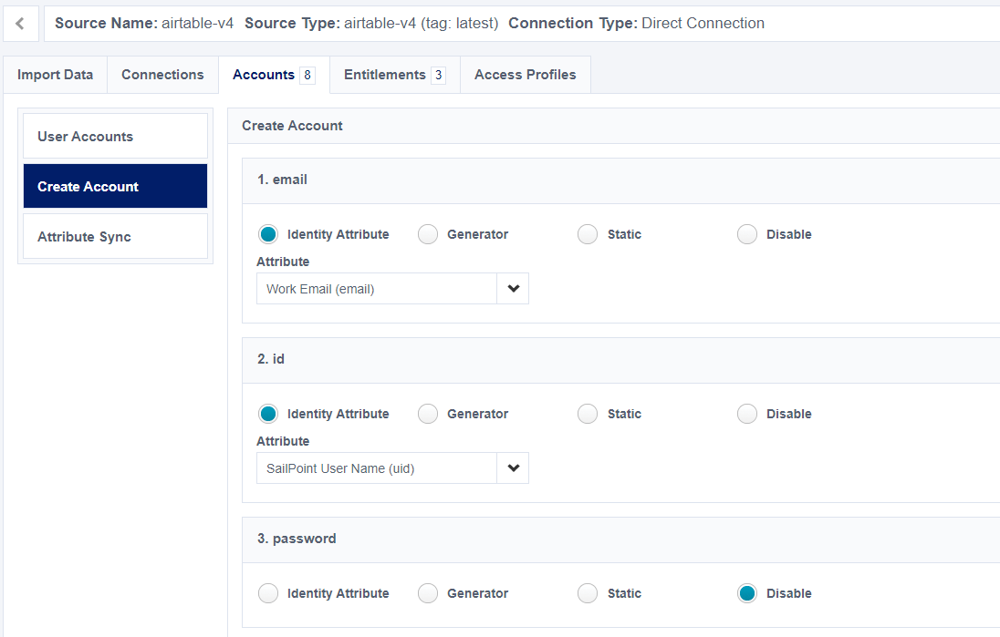
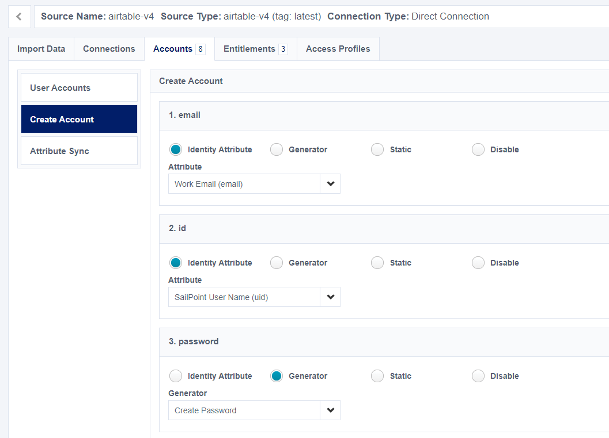
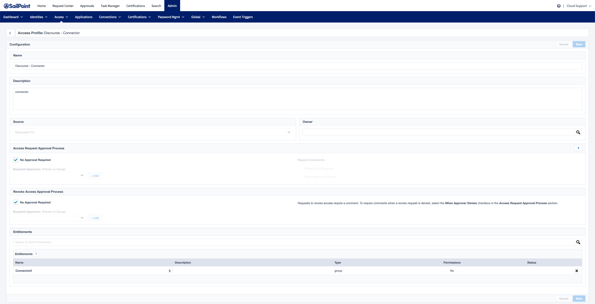

# Account Create

| Input/Output |  Data Type                  |
|:-------------|:---------------------------:|
| Input        | StdAccountCreateInput       |
| Output       | StdAccountCreateOutput      |

### Example StdAccountCreateInput
```javascript
{
    "attributes": {
        "id": "john.doe",
        "email": "example@gmail.com",
        "department": "external",
        "displayName": "John Doe",
        "password": "test",
        "entitlements": [
            "user",
            "administrator"
        ]
    }
}
```
### Example StdAccountCreateOutput
```javascript
{
    "key": {
        "simple": {
            "id": "john.doe"
        }
    },
    "disabled": false,
    "locked": false,
    "attributes": {
        "id": "john.doe",
        "displayName": "John Doe",
        "email": "example@sailpoint.com",
        "entitlements": [
            "administrator",
            "sailpoint"
        ]
    }
}
```
## Description
The account create command triggers whenever IDN is told to provision entitlements for an identity on the target source, but no account for the identity on the target source exists yet. For example, if you create an access profile that grants a group on the target source and then add that access profile to a role, any identity matching that role’s membership criteria will be granted to the group. IDN determines which identities do not have accounts on the target source and triggers the account create command for each identity. If an identity already has an account, then it invokes the account update command.

## The Provisioning Plan
The account create command accepts a provisioning plan from IDN and creates the corresponding account(s) in the target source. When you configure your source in IDN, you must set up ‘Create Profile’ to tell IDN how to provision new accounts for your source.

You can create the provisioning plan through the ```accountCreateTemplate``` in the ```connector-spec.json``` file, and you can also modify its behavior in IDN using the create profile screen:



‘Create Profile’ provides the instructions for the provisioning plan and determines which attributes are sent to your connector code. For example, if all the account attributes in the preceding image are configured for a value, then the following JSON payload is sent to your connector:

```javascript
{
    "key": {
        "simple": {
            "id": "john.doe"
        }
    },
    "disabled": false,
    "locked": false,
    "attributes": {
        "id": "john.doe",
        "password": "secretPassword",
        "email": "example@sailpoint.com",
        "entitlements": [
            "administrator",
            "sailpoint"
        ]
    }
}
```
The provisioning plan does not include any disabled attributes. In the earlier image, ```password``` is disabled, so the payload to your connector does not not include a field for ```password```:

```javascript
{
    "key": {
        "simple": {
            "id": "john.doe"
        }
    },
    "disabled": false,
    "locked": false,
    "attributes": {
        "id": "john.doe",
        "email": "example@sailpoint.com",
        "entitlements": [
            "administrator",
            "sailpoint"
        ]
    }
}
```
The provisioning plan presents multi-valued entitlements in two different ways: 

If a multi-valued entitlement, like groups, has only one value, then the provisioning plan represents it as a string value:

```javascript
{
    "key": {
        "simple": {
            "id": "john.doe"
        }
    },
    "disabled": false,
    "locked": false,
    "attributes": {
        "id": "john.doe",
        "email": "example@sailpoint.com",
        "entitlements": "user"
    }
}
```
If a multi-valued entitlement has more than one value, then the plan represents it as an array:

```javascript
{
    "key": {
        "simple": {
            "id": "john.doe"
        }
    },
    "disabled": false,
    "locked": false,
    "attributes": {
        "id": "john.doe",
        "email": "example@sailpoint.com",
        "entitlements": [
            "administrator",
            "sailpoint"
        ]
    }
}
```
Your connector code must handle the possibility of both cases. The following code example from [AirtableAccount.ts](https://github.com/sailpoint-oss/airtable-example-connector/blob/main/src/models/AirtableAccount.ts) shows how to handle a multi-valued attribute:

```javascript
public static createWithStdAccountCreateInput(record: StdAccountCreateInput): AirtableAccount {
    const account = new AirtableAccount();
    ...
    if (record.attributes['entitlements'] != null) {
        if (!Array.isArray(record.attributes['entitlements'])) {
            account.entitlments = [record.attributes['entitlements']]
        } else {
            account.entitlments = record.attributes['entitlements']
        }
    } else {
        account.entitlments = []
    }

    return account;
}
```
## The return object
When the account is returned to IDN, any values you set are updated in IDN. So if an account ID is auto-generated on the source system, you must send the account ID back to IDN so IDN is aware of it for future account update activities. This is useful for the compound key type.

## Password Handling
There are three main ways to handle passwords on a source:

1. SSO, LDAP, or other federated authentication mechanisms are the preferred means of providing user login on a target source. If your source can integrate with a federated login service, use that service. If your source requires you to provide a password when you create accounts, even with a federated login, it is best to create a strong, random password. Your users will use the federated login, so they never need to know this password.

2. If your source has a password reset feature at login, it is best to initially create the account with a strong, random password the user does not have access to. Once the account is created, make the user request a password reset to set their own password. This method is the safest alternative to federated authentication because the initial password is strong and never known to anyone, and the user can generate his or her own password through secure channels.

3. The least secure method is setting a static password in the create profile that is well known among your users. This approach is not recommended. It does not require any automated communications with your users.

There are two ways you can generate random passwords:

1. Use the “Create Password” generator in ‘Create Profile.’ (This can also be configured in the ```accountCreateTemplate```)



2. Disable the 'password' field.

Use ‘Create Profile’ and generate a random password in code. There are some JavaScript libraries that can generate random strings suitable for passwords, like [random-string](https://www.npmjs.com/package/random-string) and [crypto-random-string](https://www.npmjs.com/package/crypto-random-string). Import either one of these libraries into your code to use them. The following example from [airtable.ts](https://github.com/sailpoint-oss/airtable-example-connector/blob/main/src/airtable.ts) uses a ternary operator to ensure the password is always provided. If the provisioning plan provides a password, use that value. If the provisioning plan does not provide a password, generate a random one.

```javascript
async createAccount(input: StdAccountCreateInput): Promise<AirtableAccount> {
    const account = AirtableAccount.createWithStdAccountCreateInput(input);

    return this.airTableBase('Users').create({
        "displayName": account.displayName,
        "email": account.email,
        "id": account.id,
        "enabled": account.enabled ? 'true' : 'false',
        "department": account.department,
        "firstName": account.firstName,
        "lastName": account.lastName,
        "locked": account.locked ? 'true' : 'false',
        "password": account.password ? account.password : crypto.randomBytes(20).toString('hex'),
        "entitlements": account.entitlments.join(',') 
    }).then(record => {
        const airtableRecord = AirtableAccount.createWithRecords(record)
        return airtableRecord
    }).catch(err => {
        throw new ConnectorError('error while getting accounts: ' + err)
    })

}
```
## Testing in IdentityNow

One way to test whether the account create code works in IDN is to set up an access profile and role that grants members an entitlement from the connector’s target source. Start by creating an access profile that grants one or more entitlements from the target source.



Next, create a role that uses the access profile created in the previous step.


Modify the role membership to use ‘Identity List’ and select one or more users that do not have accounts in the target source yet.


Click the ‘Update’ button in the upper right corner to initiate the account provisioning process. Doing so creates the account(s) on the target source once the process is complete.