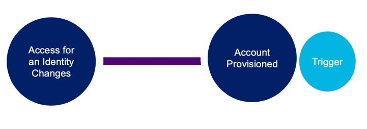

# Provisioning Action Completed

## Event context

The Provisioning Action Completed event trigger notifies subscribed applications after the action is completed. This event trigger provides a flexible way to extend the Provisioning workflow after access has changed for an identity within SailPoint. This provides more proactive governance and ensure users can quickly obtain needed access. Some examples of how this trigger can be used include:

- Notify the requester that the access request has been fulfilled.
- Notify an application user and/or access certifier that access has been revoked.
- Notify an administrator or system that provisioning has been completed.
- Notify a third party system to trigger another action (e.g. continue additional provisioning actions) or simply for auditing of provisioning activities.

## Prerequisites

Before consuming this event trigger, the following prerequesites must be met.

- An oAuth Client configured with authority as `ORG_ADMIN`.
- An org enabled with the `ARSENAL_ALLOW_POSTPROVISIONING_TRIGGERS` feature flag.
- Configure connectors for Provisioning into target applications.
- An org configured for automated Provisioning. See Event context section for specific setup.

In order to provision to a target application, the connector for the source needs to support the following connector features:

- `ENABLE` - Can enable or disable an account.
- `UNLOCK` - Can lock or unlock an account.
- `PROVISIONING` - Can write to accounts. Currently, the trigger does not include attribute synchronization.
- `PASSWORD` - Can update password for account

For a list of supported connectors and features, see [Supported Connectors for IdentityNow](https://community.sailpoint.com/t5/Connectors/Supported-Sources-Connectors-for-IdentityNow/ta-p/80019).

For information about configuring sources for provisioning, see [How can I edit the Create Profile on a source?](https://community.sailpoint.com/t5/Connectors/How-can-I-edit-the-Create-Profile-on-a-source/ta-p/74429).

Provisioning events occur in these workflows:

- [Access Request](#access-request)
- [Certification](#certification)
- [Role Membership](#role-membership)
- [Lifecycle Management](#lifecycle-management)
- [Password Management](#password-management)

### Access Request

When an Access Request approval process has completed with all positive approvals, the access request is fulfilled with provisioning to the target application with requested access.

Access acquired through a role request can also be revoked and those changes can be provisioned to an account.

The following steps need to be completed:

- Source Connector configured for `PROVISIONING`.
Access Request in SailPoint SaaS currently does not support `ACCOUNT_ONLY_REQUEST` or `ADDITIONAL_ACCOUNT_REQUEST`.
- Source Entitlements mapped in Account Schema.
- Access Profile using Source Entitlements. Role setup is optional.
- Application enabled for Access Request.

> **NOTE:** There is no indication to the approver in the IdentityNow UI that the approval is for a revoke action. This must be considered for all usage of these APIs.

### Certification

To provision removal of accounts acquired through Access Request is through Certifications.
> **Note:** Certifications cannot revoke access acquired via Role Membership or Lifecycle Changes.

### Role membership

Access defined in access profiles can be grouped into Roles and Roles can be assigned to identities using `COMPLEX_CRITERION` or `IDENTITY_LIST`. For information on how to set `COMPLEX_CRITERION`, see [Admin UI](https://community.sailpoint.com/t5/Admin-Help/Standard-Role-Membership-Criteria-Options/ta-p/74392)
> **Note:** Using `CUSTOM` Role Membership through Rules is no longer supported.

Additionally, roles can be mapped from an authoritative source.

### Lifecycle Management

This trigger will fire when an account has been provisioned, enabled, or disabled.

To provision access with lifecycle states, the following steps must be completed:

- Source Connector configured for `ENABLE` to enable/disable accounts and/or `PROVISIONING` to create/update/delete accounts.
- Source Entitlements mapped from Authoritative Source
- Source Entitlements mapped to Access Profiles
- Identity Profile using authoritative source
- Lifecycle states configured. To set up, follow this [guide].

### Password Management

Password changes can be provisioned to target applications through password reset or password interception. Also, unlocking of accounts can be provisioned via password change within SailPoint SaaS.

For password management setup, you will need to configure:

- Source Connector configured for `PASSWORD` for password changes and/or `UNLOCK` for unlocking changes.
- Password Sync Group

## Additional information and links

- **Trigger Type**: [FIRE_AND_FORGET](../event-triggers-trigger-types.md#fire-and-forget)
- [Input schema](https://developer.sailpoint.com/apis/beta/#section/Provisioning-Completed-Event-Trigger-Input)
