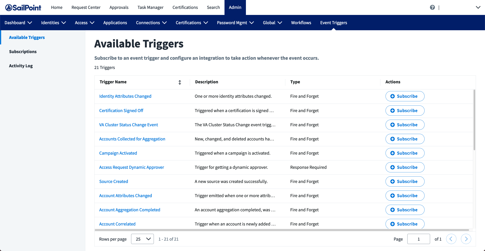

# Subscribing to a trigger

## View the available triggers

<<<<<<< HEAD
New event triggers are continually being developed by SailPoint to satisfy a variety of use cases. Some of these triggers are considered **early access** and are only available in an IDN tenant upon request. To see a list of available event triggers in your tenant, navigate to the **Event Triggers** tab in the **Admin** section of IdentityNow. The first page you will see is a list of available event triggers in your tenant. You can click on each trigger to learn more about what type it is, what causes it to fire, and what the payload will look like.
=======
SailPoint is continuously developing new event triggers to satisfy different use cases.  Some of these triggers are considered **early access** and are only available in an IDN tenant upon request.  To see a list of available event triggers in your tenant, go to the **Event Triggers** tab in the **Admin** section of IdentityNow.  The first page is a list of your tenant's available event triggers. You can select each trigger to learn more about its type, what causes it to fire, and what the payload will look like.
>>>>>>> 41e59e59161357e11138ed99d3a09231e2a49c46

## Subscribe to a trigger from the UI

Usually, you will subscribe to event triggers using the user interface in IDN.
Refer to [subscribing to event triggers](https://documentation.sailpoint.com/saas/help/common/event_triggers.html#subscribing-to-event-triggers) to learn how to subscribe to an event trigger through the IDN UI.

## Subscribe to a trigger from the API

<<<<<<< HEAD
Sometimes, you might have to use the API to subscribe to event triggers. This can occur when you want to programatically subscribe/unsubscribe from event triggers in a custom application or no code solution that doesn't have a native integration with SailPoint.
=======
Sometimes, you may need to use the API to subscribe to event triggers.  This can occur when you want to programatically subscribe/unsubscribe from event triggers in a custom application or no-code solution that does not have a native integration with SailPoint.
>>>>>>> 41e59e59161357e11138ed99d3a09231e2a49c46

If this is your first time calling a SailPoint API, refer to the [getting started guide](../getting-started/index.md) to learn how to generate a token and call the APIs.

<<<<<<< HEAD
Start by reviewing the list of [available event triggers](/idn/api/beta/triggers#available-event-triggers), and take note of the **ID** of the trigger that you want to subscribe to (ex `idn:access-request-dynamic-approver`). Use the [create subscription](/idn/api/beta/create-subscription) endpoint to subscribe to an event trigger of your choosing. See the API docs for the latest details on how to craft a subscription request.
=======
Start by reviewing the list of [available event triggers](/idn/api/beta/triggers#available-event-triggers), and take note of the **ID** of the trigger you want to subscribe to (ex `idn:access-request-dynamic-approver`).  Use the [create subscription](/idn/api/beta/create-subscription) endpoint to subscribe to an event trigger of your choosing.  See the API docs for the latest details about how to craft a subscription request.
>>>>>>> 41e59e59161357e11138ed99d3a09231e2a49c46
