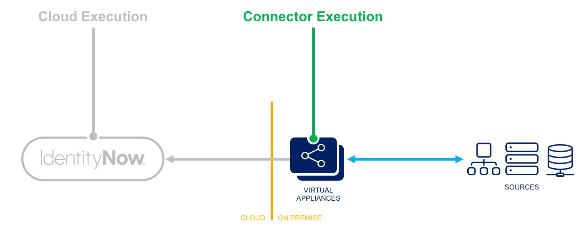

# Web Services After Operation Rule

## Overview

This rule is used to calculate attributes after a web-service operation call.

## Execution

- **Connector Execution** - This rule executes within the Virtual Appliance and may offer special abilities to perform connector-related functions, and may offer managed connections to sources.
- **Logging** - Logging statements are viewable within the ccg.log on the Virtual Appliance and by SailPoint personnel.



## Input

| Argument                | Type                                              | Purpose                                                                    |
| ----------------        | ------------------------------------------------- | -------------------------------------------------------------------------- |
| application             | sailpoint.object.Application                      | Application whose data file is being processed                             |
| processedResponseObject | List<Map<String, Object>>                         | This object is List of Map (account/group). The map contains key as identityAttribute of the application schema and value is all the account/group attributes (schema) passed by the connector after parsing the respective API response. |
| requestEndPoint         | sailpoint.connector.webservices.EndPoint          | Current request information; contains the header, body, context url, method type, response attribute map, successful response code |
| restClient              | sailpoint.connector.webservices.WebServicesClient | A WebServicesClient (HttpClient) object that would enable the user to call the Web Services API target system. |
| rawResponseObject       | String                                            | String object which holds the raw response returned from the target system which can be in JSON or XML form. |

## Output

| Argument                  | Type                                            | Purpose                                                            |
| ------------------------- | ----------------------------------------------- | ------------------------------------------------------------------ |
| updatedAccountOrGroupList | java.util.Map                                   | The `Map` object returned from the After Operation Rule may contain any or all of the following: Updated list of account / group resource objects; identified by key `data`/ Attribute values to be updated into application via connector state map; identified by key `connectorStateMap`. Each resource (account/group) object is of type Map which contains **key-value** pair, where **key** represents the schema attribute name and **value** represents the account/group attribute value. |

## Template

```xml
<?xml version='1.0' encoding='UTF-8'?>
<!DOCTYPE Rule PUBLIC "sailpoint.dtd" "sailpoint.dtd">
<Rule name="Example Rule" type="WebServiceAfterOperationRule">
  <Description>Describe your rule here.</Description>
  <Source><![CDATA[

  // Add your logic here.

  ]]></Source>
</Rule>
```

## Example

```java
<?xml version='1.0' encoding='UTF-8'?>
<!DOCTYPE Rule PUBLIC "sailpoint.dtd" "sailpoint.dtd">
<Rule name="Example Rule" type="WebServiceAfterOperationRule">
  <Description>This rule is used by the  Web Services connector after performing any operation like testconnection, aggregation etc.</Description>
  <Source><![CDATA[
import connector.common.JsonUtil;
    import java.util.HashMap;
    import java.util.Map.Entry;
    import java.util.Map;
    import java.util.List;
    import java.util.ArrayList;
    import javax.net.ssl.HttpsURLConnection;
    import java.io.BufferedReader;
    import java.io.PrintStream;
    import java.io.StringWriter;
    import java.text.SimpleDateFormat;
    import sailpoint.tools.GeneralException;

Map updatedMapInfo = new HashMap();
List list = new ArrayList();
ArrayList<String> Roles = new ArrayList<String>();
Map response = (Map) JsonUtil.toMap(rawResponseObject);
int RoleSize = 0;
String newName;
List Finallist = new ArrayList();
List workspace = new ArrayList();

log.error("RULES response at start" + response);
if (response.get("data") != null) {

     list = (ArrayList) response.get("data");

     for(int d = 0; d < list.size(); d++ ){

         Map responseMap = (Map) list.get(d);

         if (responseMap.get("attributes") != null) {
            Map newmap = new HashMap();
             Map data = (Map) responseMap.get("attributes");
             newmap.put("firstName", data.get("firstName"));
             newmap.put("lastName",data.get("lastName"));
             newmap.put("displayName",data.get("displayName"));
             newmap.put("userName",data.get("userName"));
             newmap.put("email",data.get("email"));

             if (data.get("workspaceMemberships") != null) {

                 ArrayList Workspacedetail = (ArrayList) data.get("workspaceMemberships");

                 for (int i = 0; i < Workspacedetail.size(); i++) {

                     Map work = (Map) Workspacedetail.get(i);

                     for (int w = 0; w < work.size(); w++) {

                         if (work.get("workspaceName") != null) {

                            workspace.add(work.get("workspaceName"));

                             Roles = (ArrayList) work.get("workspaceRoles");

                             for (int r = 0; r < Roles.size(); r++) {

                                 if (Roles.get(r) != null) {
                                     newName = Roles.get(r).toString() + " - " + work.get("workspaceName");

                                     if(newName != null) {
                                         Roles.set(r, newName);
                                         newmap.put("workspaceRoles", Roles);

                                     }

                                 }
                             }
                         }
                         break;
                     }
                 }
             }

             Finallist.add(newmap);

         }
    }

}
log.error("RULES newmap at end" + newmap);
log.error("RULES Finallist at end" + Finallist);

log.error("RULES processedResponseObject Before is " + processedResponseObject);

updatedMapInfo.put("data", Finallist);
log.error("RULES updatedMapInfo is " + updatedMapInfo);

return updatedMapInfo;
log.error("RULES processedResponseObject after is " + processedResponseObject);​
  ]]></Source>
</Rule>
```
