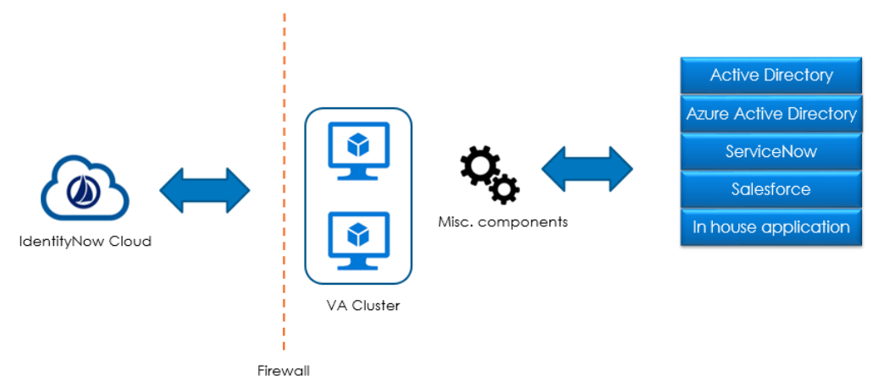

SaaS Connectivity is a cloud based connector runtime that makes developing and deploying web service connectors easier than Connector 1.0 does.  However, because the cloud hosts SaaS Connectivity, not a Virtual Appliance (VA), SaaS Connectivity is limited in the types of applications it can connect to.  For example, you cannot use SaaS Connectivity to connect to on-prem services that can only communicate within an intranet (no public internet access).  This excludes JDBC and Mainframe applications, to name a few.

## What Are Connectors

Connectors are the bridges between the SailPoint Identity Now (IDN) SaaS platform and the source systems that IDN needs to communicate with and aggregate data from. An example of a source system IDN may need to communicate with would be an Oracle HR system or GitHub. In these cases, IDN synchronizes data between systems to ensure account entitlements and state are correct through the organization.

## Why Are We Introducing a New Connector

VA connectors always communicate with external sources through the Virtual Appliance (VA) as seen in the diagram below:

VA connectors can be disadvantageous because you need an on-prem virtual appliance to have any external connectivity with them, even when that connectivity is a SaaS service like Salesforce.com. 

It is also challenging to create a custom connector in the VA Connector framework. Therefore, there are generic connectors available such as flat file, JDBC and webservice connectors. These options provide flexibility in configuring almost any source, but this configuration can be complex. For example, when you create a JDBC connector, you must use SQL to define the data model.

The new Cloud connectors work differently - they run on the IDN platform instead (see diagram below).

With this process, you can run an entire IDN instance without a VA. The new connector also includes a CLI tool to manage cloud connectors and an SDK to create custom connectors. Because it is simpler to create a custom connector, you can create specific connectors for a variety of sources, and the connectors' configuration can be much simpler. For example, you can now configure a formerly complicated webservice connector by providing two parameters (Base URL and API Key) in a custom cloud connector.