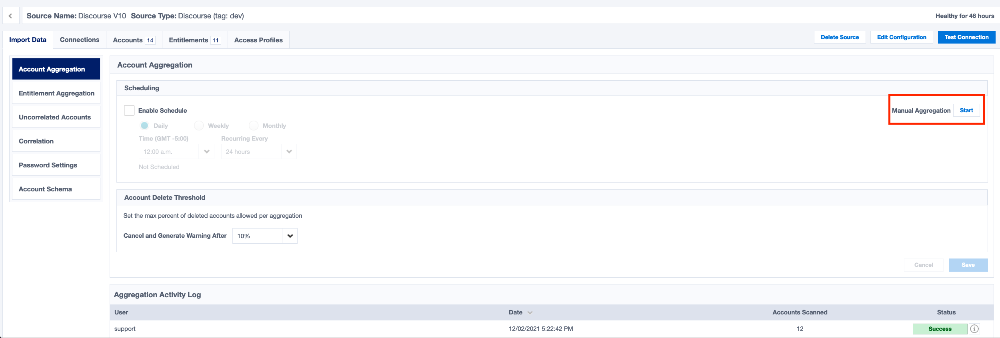

# Account List

| Input/Output |  Data Type                |
|:-------------|:-------------------------:|
| Input        | undefined                 |
| Output       | StdAccountListOutput      |

### Example StdAccountListOutput
```javascript
{
    "key": {
        "simple": {
            "id": "john.doe"
        }
    },
    "disabled": false,
    "locked": false,
    "attributes": {
        "id": "john.doe",
        "displayName": "John Doe",
        "email": "example@sailpoint.com",
        "entitlements": [
            "administrator",
            "sailpoint"
        ]
    }
}
```

## Description
The account list command aggregates all accounts from the target source into IdentityNow. IDN calls this command during a manual or scheduled account aggregation.



## Implementation
For you to be able to implement this endpoint, the web service must expose an API for listing user accounts and entitlements (i.e. roles or groups). Sometimes, a target source’s API has a single endpoint providing all the attributes and entitlements a source account contains. However, some APIs may break these attributes and entitlements into separate API endpoints, requiring you to make multiple calls to gather all an account's necessary data. The following code from [airtable.ts](https://github.com/sailpoint-oss/airtable-example-connector/blob/main/src/airtable.ts) shows the necessary steps to create a complete account from the various endpoints the API offers:

```javascript
async getAllAccounts(): Promise<AirtableAccount[]> {
    return this.airTableBase('Users').select({
        view: 'Grid view'
    }).firstPage().then(records => {
        const recordArray: Array<AirtableAccount> = []
        for (const record of records) {
            recordArray.push(AirtableAccount.createWithRecords(record))
        }
        return recordArray
    }).catch(err => {
        throw new ConnectorError('error while getting accounts: ' + err)
    })
}
```

The following code snippet from [index.ts](https://github.com/sailpoint-oss/airtable-example-connector/blob/main/src/index.ts) shows how to register the account list command on the connector object:

```javascript
export const connector = async () => {

    // Get connector source config
    const config = await readConfig()

    // Use the vendor SDK, or implement own client as necessary, to initialize a client
    const airtable = new AirtableClient(config)

    return createConnector()
        .stdAccountList(async (context: Context, input: undefined, res: Response<StdAccountListOutput>) => {
            const accounts = await airtable.getAllAccounts()

            for (const account of accounts) {
                res.send(account.toStdAccountListOutput())
            }
        })
...
```

IDN expects each user in the target source to be converted into a format IDN understands. The specific attributes the web service returns depend on what your source provides.

```javascript
public toStdAccountListOutput(): StdAccountListOutput {
    return this.buildStandardObject();
}

private buildStandardObject(): StdAccountListOutput | StdAccountCreateOutput | StdAccountReadOutput | StdAccountListOutput {
    return {
        key: SimpleKey(this.id),
        disabled: !this.enabled,
        locked: this.locked,
        attributes: {
            id: this.id,
            displayName: this.displayName,
            department: this.department,
            firstName: this.firstName,
            lastName: this.lastName,
            email: this.email,
            entitlements: this.entitlments,
        },
    }
}
```

The result of the account list command is not an array of objects but several individual objects. This is the format IDN expects, so if you see something like the following result while testing, it is normal:

```javascript
{
    "key": {
        "simple": {
            "id": "john.doe"
        }
    },
    "disabled": false,
    "locked": false,
    "attributes": {
        "id": "john.doe",
        "displayName": "John Doe",
        "department": "sailpoint admins",
        "firstName": "John",
        "lastName": "Doe",
        "email": "example@sailpoint.com",
        "entitlements": [
            "administrator",
            "sailpoint"
        ]
    }
}
{
    "key": {
        "simple": {
            "id": "john"
        }
    },
    "disabled": false,
    "locked": false,
    "attributes": {
        "id": "john",
        "displayName": "John Doe External",
        "department": "external",
        "firstName": "John",
        "lastName": "Doe",
        "email": "example@gmail.com",
        "entitlements": [
            "administrator"
        ]
    }
}
```